# Project-2

Documentation for project 2 

#INSTALLING THE NGINX WEB SERVER

`sudo apt update`

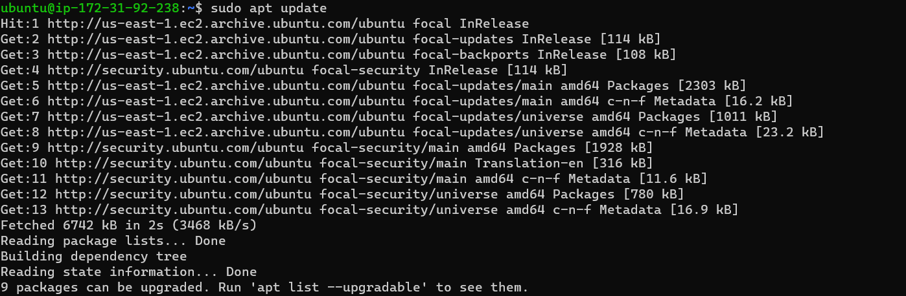

`sudo apt install nginx`

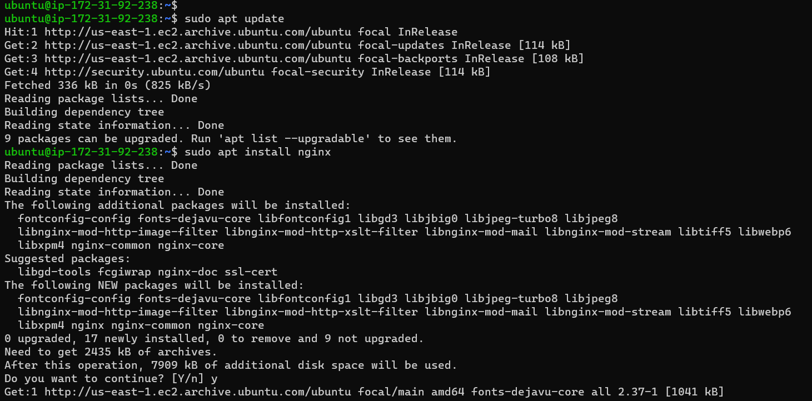

`sudo systemctl status nginx`

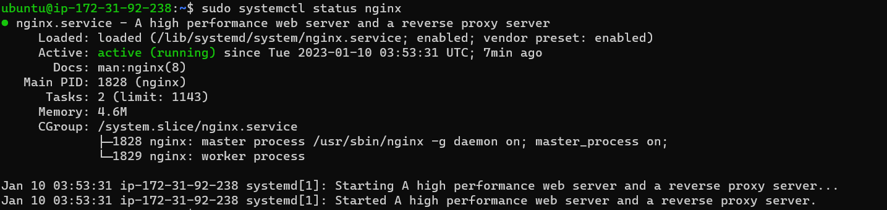

`Public IP address`

# INSTALLING MYSQL

`sudo apt install mysql server`

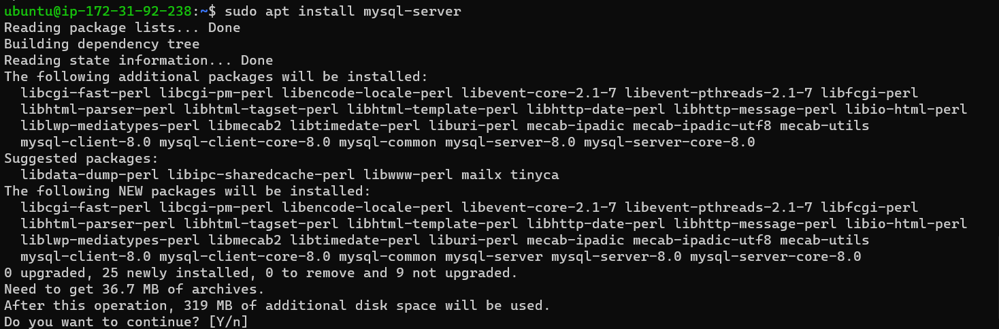

`sudo mysql`

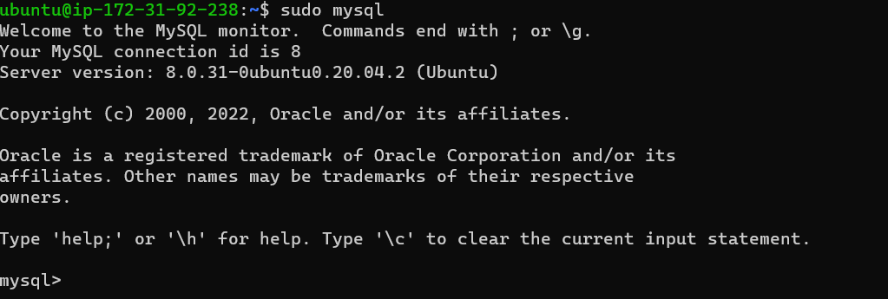

`mysql database`

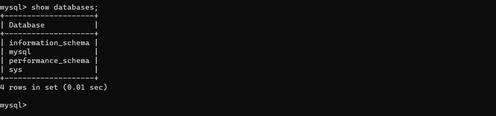

`mysql exit`

# INSTALLING PHP

You have Nginx installed to serve your content and MySQL installed to store and manage your data. Now you can install PHP to process code and generate dynamic content for the web server.

`sudo apt install php-fpm php-mysql`

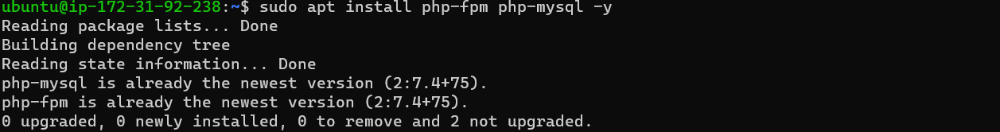

  # CONFIGURING NGINX TO USE PHP PROCESSOR

  When using the Nginx web server, we can create server blocks (similar to virtual hosts in Apache) to encapsulate configuration details and host more than one domain on a single server. In this guide, we will use projectLEMP as an example domain name.

On Ubuntu 20.04, Nginx has one server block enabled by default and is configured to serve documents out of a directory at /var/www/html. While this works well for a single site, it can become difficult to manage if you are hosting multiple sites. Instead of modifying /var/www/html, we’ll create a directory structure within /var/www for the your_domain website, leaving /var/www/html in place as the default directory to be served if a client request does not match any other sites.

`sudo mkdir /var/www/projectLEMP`

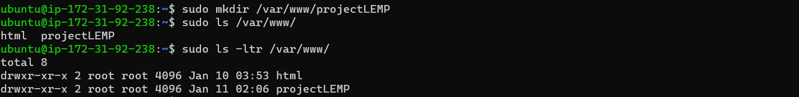

`sudo chown -R $USER:$USER /var/www/projectLEMP`

`#/etc/nginx/sites-available/projectLEMP`

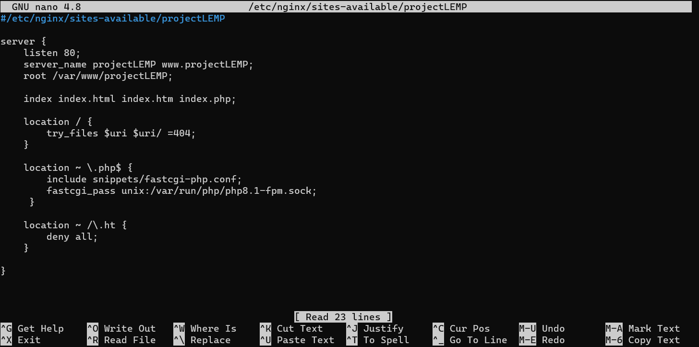

`sudo nginx -t`

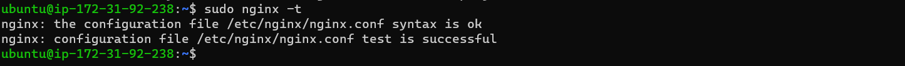

`sudo unlink /etc/nginx/sites-enabled/default`

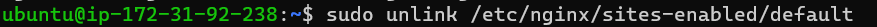

`sudo systemctl reload nginx`

`sudo echo 'Hello LEMP from hostname`

# TESTING PHP WITH NGINX

LEMP stack should now be completely set up

`PHP code that will return information about your server`

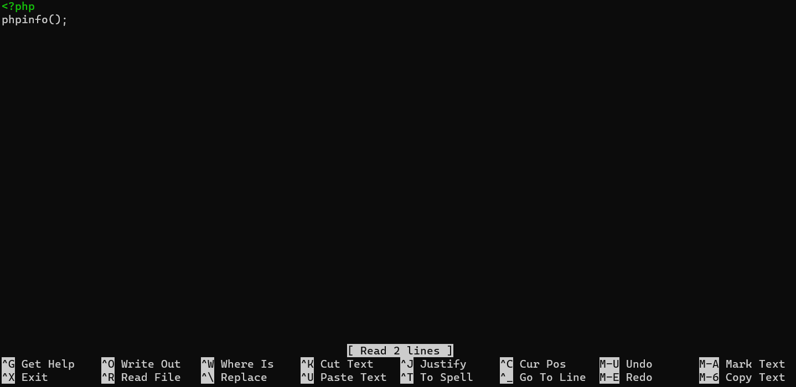

`Testing PHP with Nginx public IP info php`

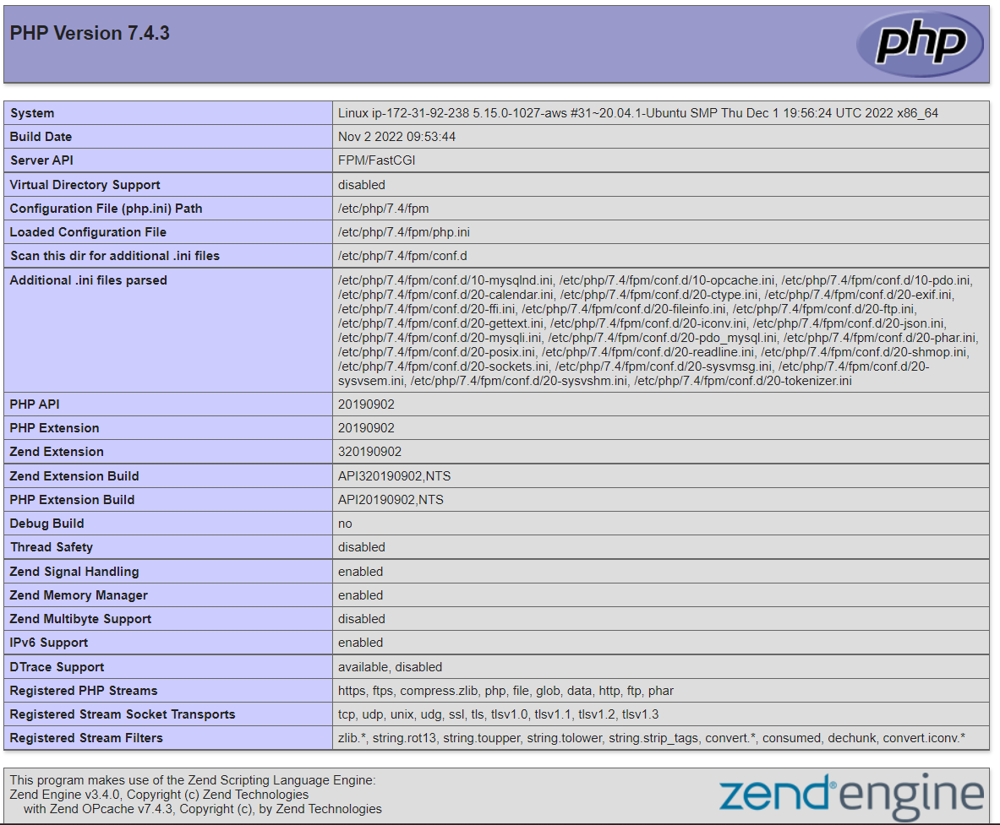

`404 Not Found`

# RETRIEVING DATA FROM MYSQL DATABASE WITH PHP (CONTINUED)

To do list" and configure access to it, so the Nginx website would be able to query data from the DB and display it

`CREATE USER`

`GRANT ALL ON example_database`

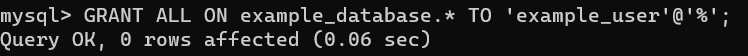

`logging in to the MySQL console`

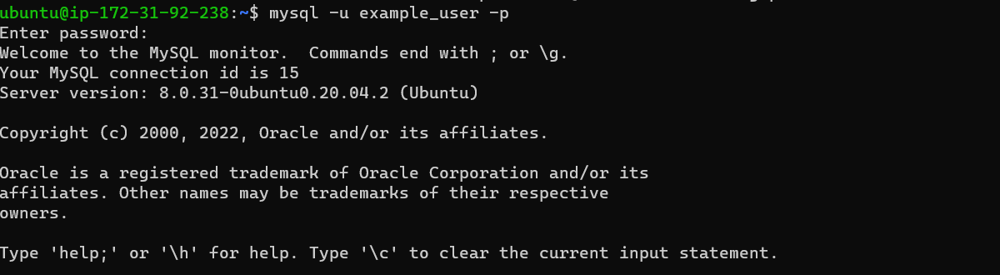

`Show Databases`

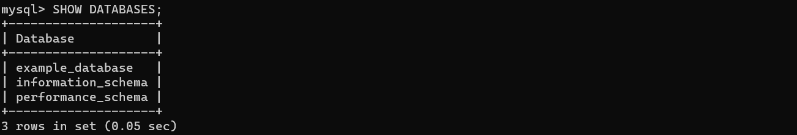

`CREATE TABLE example_database.todo_list`

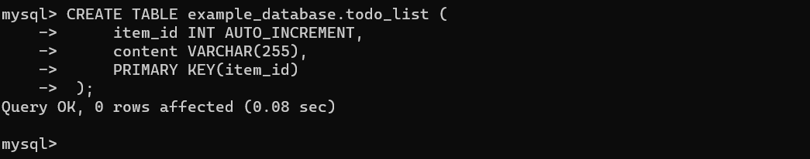

`INSERT INTO example_database.todo_list(content) VALUES`

%20VALUES.png)

`SELECT FROM example_database.todo_list`

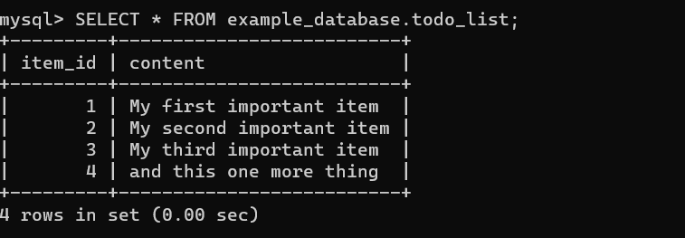

The following PHP script connects to the MySQL database and queries for the content of the todo_list table, displays the results in a list. If there is a problem with the database connection, it will throw an exception.

